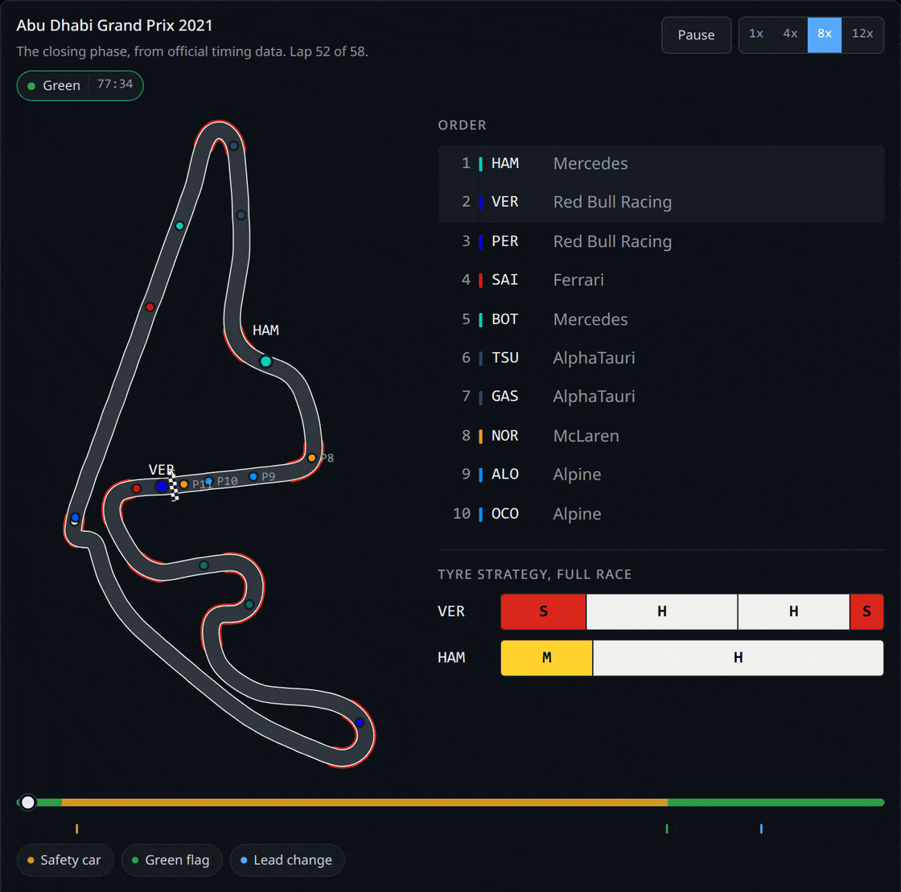
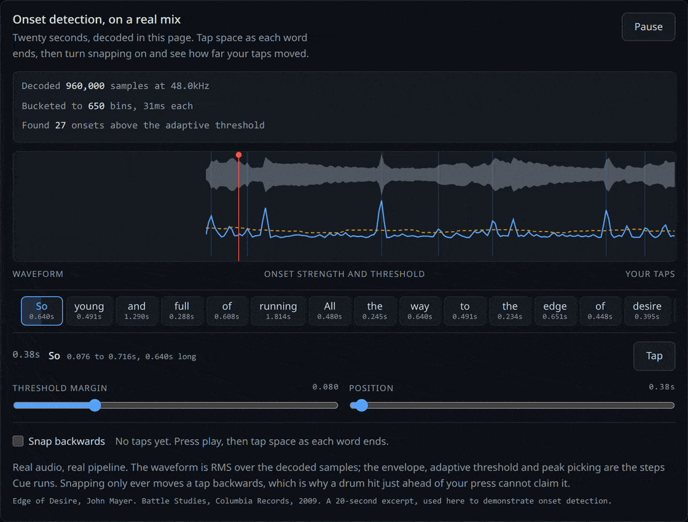
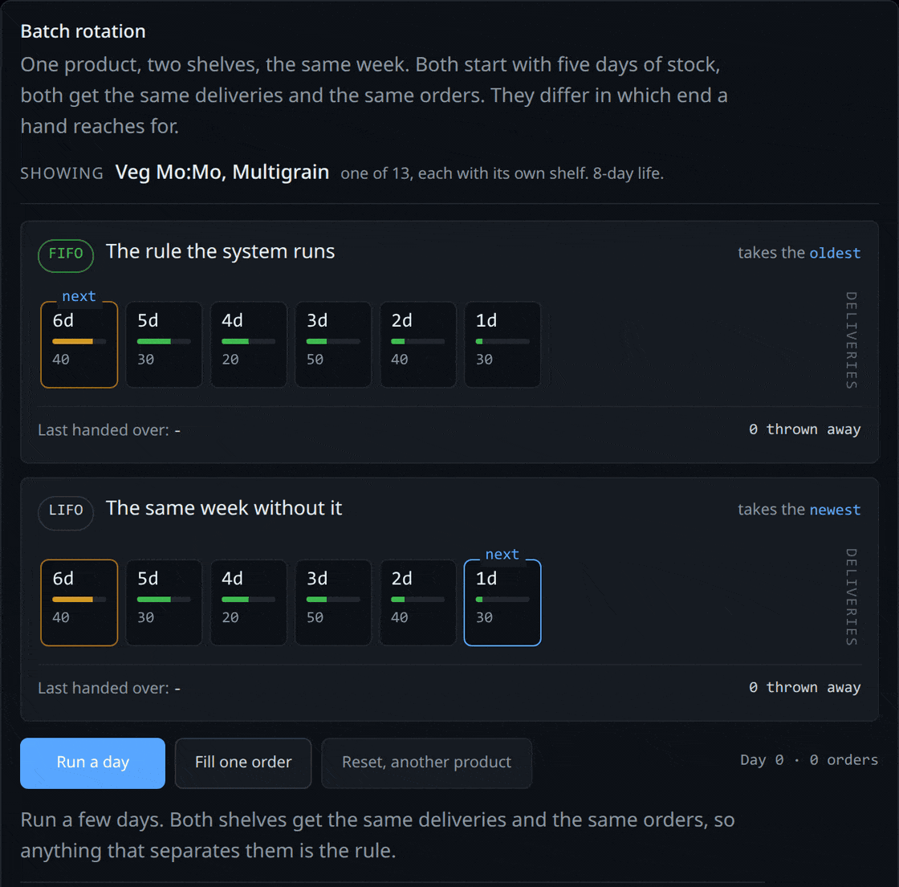
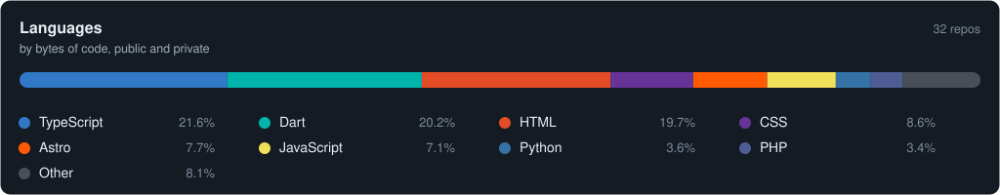
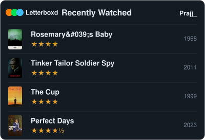

<picture>
  <source media="(prefers-color-scheme: dark)" srcset="./images/readme/header-dark.svg">
  
</picture>

  <a href="https://prajjwalveerbasnet.com"><picture><source media="(prefers-color-scheme: dark)" srcset="./images/readme/pills/website-dark.svg"></picture></a>
  <a href="https://prajjwalveerbasnet.com/cv"><picture><source media="(prefers-color-scheme: dark)" srcset="./images/readme/pills/cv-dark.svg"></picture></a>
  <a href="https://www.linkedin.com/in/prajj/"><picture><source media="(prefers-color-scheme: dark)" srcset="./images/readme/pills/linkedin-dark.svg"></picture></a>
  <a href="mailto:contact@prajjwalveerbasnet.com"><picture><source media="(prefers-color-scheme: dark)" srcset="./images/readme/pills/email-dark.svg"></picture></a>

  

---

# My latest work :

I've been working on some projects for the past couple of months (some more than others) and here are some of them. You can try all of them on my website and learn more about them. 

## [Slipstream](https://prajjwalveerbasnet.com/projects/slipstream)

### F1 usually focuses on the first five contenders. SlipStream lets you choose who you want to see.

It also provides everyone who has
raced since the 1950s their full history, along with customizable widgets.

 

<a href="https://prajjwalveerbasnet.com/projects/slipstream#see-it-working"><picture><source media="(prefers-color-scheme: dark)" srcset="./images/readme/callouts/slipstream-dark.svg"></picture></a>

 

## [Cue](https://prajjwalveerbasnet.com/projects/cue)

### You cannot press a button at the instant of a sound.

Reaction time puts every hand-made
lyric timing around 150 ms late. Cue's goal is to tap *approximately* right, and let three independent
mechanisms improve the average human timing.

 

<a href="https://prajjwalveerbasnet.com/projects/cue#see-it-working"><picture><source media="(prefers-color-scheme: dark)" srcset="./images/readme/callouts/cue-dark.svg"></picture></a>

 

## [Shobha's Delicacies](https://prajjwalveerbasnet.com/projects/shobhas-delicacies)

### My mother runs a frozen-food kitchen in Kathmandu.

Like a small scale business it ran on a simple bill book and the notes app
on my phone. This app was built to replace both and make it scalable in the future with an inventory management system, POS and a storefront all running on one database, which I and five of our staff use daily.

 

<a href="https://prajjwalveerbasnet.com/projects/shobhas-delicacies/#see-it-working"><picture><source media="(prefers-color-scheme: dark)" srcset="./images/readme/callouts/shobha-dark.svg"></picture></a>

---

# Other Projects

| Project | What it is |
|---|---|
| [Song Reference Network](https://prajjwalveerbasnet.com/projects/song-reference-network) | Building an open network of songs that name-drop other songs. |
| [TB Prediction](https://prajjwalveerbasnet.com/projects/tb-prediction) | On-device chest X-ray screening for rural Nepali clinics with no radiologist. It can answer "I don't know". Presented at CAN Info-Tech 2024. |
| [Temporal Reference Resolution](https://prajjwalveerbasnet.com/projects/temporal-reference-resolution) | Second annotator and evaluation lead on a three-model transformer study; the evaluation work changed what the repository reports. |

**[See all of my ten projects →](https://prajjwalveerbasnet.com/projects)**

---

# Currently

- Finishing **Slipstream** for a public release
- Final UX phases on **Cue**, and preparing to release the first version of it.
- Building the **Song Reference Network** corpus whenever I find some time.
- Keeping **[prajjwalveerbasnet.com](https://prajjwalveerbasnet.com)** — a portfolio built as a repository view — up to date

# Stack

`Dart` · `TypeScript` · `Python` · `C#` · `Java` · `SQL` &nbsp;|&nbsp; Flutter · Riverpod · Next.js · React · Astro · Prisma · PostgreSQL &nbsp;|&nbsp; TensorFlow · Keras · pandas · NumPy &nbsp;|&nbsp; Cloudflare · Vercel · GitHub Actions · Linux

<b>Hobbies and Leisures:</b> Music, cinema, and a growing watch collection

- **Music** — I founded my college's music club in 2024 and played rhythm guitar in the student band. I love playing as many instruments I can get my hands on. Currently learning *Edge of Desire* and *Maine*. Both **Cue** and **Song Reference Network** came out of questions I had while playing, and my curiosity.
- **Cinema** — From all over the world. Tarantino, Miyazaki, Villeneuve, Kore-eda, Wong Kar-wai.
- **Games** — Single-player story games, whenever I can find the time. I think they're the future of complex storytelling. Recently finished *Ghost of Yotei* and *Hollow Knight: Silksong*.
- **Watches** — I collect and talk about them far too much. Classic timepieces truly are a dying breed.
- **Keyboards** — Recently started modding, and it is going about as well as you'd expect (please fund me).
- **Sport** — Cricket and table tennis are my favourites, but honestly I'll try any sport I can.

  
  

---

<picture>
  <source media="(prefers-color-scheme: dark)" srcset="https://raw.githubusercontent.com/Prajj-10/Prajj-10/output/snake-dark.svg">
  
</picture>

---

  <b>As most of my projects are currently a work in progress, and some might not be public in the future, all essential information about all of my projects are on my website. Do visit and give me feedback if you can. I would highly appreciate it!</b> 
  <a href="https://prajjwalveerbasnet.com">prajjwalveerbasnet.com</a>

  Prajjwal Veer Basnet · Kathmandu, Nepal

