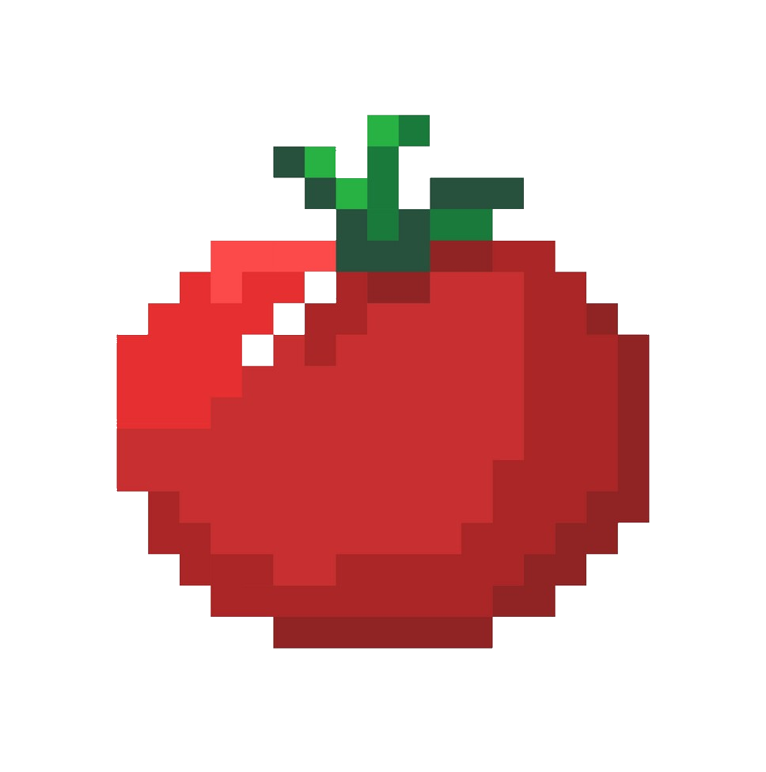

# 🙏 Namaste !

My name is Prajjwal Veer Basnet and I am a recently graduated software engineer who loves to build applications. I am keen to learn new technologies and apply them to my projects. I currently am learning and developing projects in Flutter. Currently taking a break exploring and enjoying life. Do check out my projects !

# 🔧 Technologies & Tools:

        
 
    
 
 
 
 
  

 
 

 
 
 
 
 
 
     
 

# 🌱 Currently Learning:
 

# 🚀 Projects:

<table>
  <tr>
    <td align="center" width="150">
      
    </td>
    <td>
      <b><a href="https://github.com/Prajj-10/Bhansa">Bhansa</a></b> : A recipe-sharing platform that connects users worldwide. Share your favorite recipes and explore multiple variations of the same dish from many users.
    </td>
  </tr>
  <tr>
    <td align="center" width="150">
      
    </td>
    <td>
      <b><a href="https://github.com/Prajj-10/Tomato-Game">Tomato Game</a></b> : A Sudoku-style mathematical puzzle game with two modes: classic and time challenge, offering a fun gameplay.
    </td>
  </tr>
  <tr>
    <td align="center" width="150">
      
    </td>
    <td>
      <b><a href="https://github.com/Prajj-10/Tuberculosis-Prediction-App">TB Prediction Application</a></b> : A thesis project aimed at assisting Nepalese doctors in rural areas in diagnosing tuberculosis using TensorFlow Lite.
    </td>
  </tr>
</table>
 
<b> Do check out my other projects down in the pinned section if you want to know more.</b>

# 🔥 My Most Used Languages

# 👨‍💻 About Me:

🎵 I love spending my time listening to music of all genres and styles. Currently listening to Jeremy Zucker and Chelsea Cutler's brent iii. check out my‎ ‎[‎Spotify](https://open.spotify.com/user/31mhbwq3lthnnawplg2mgdjz5jzi) playlists!

🎥 I love nerding about movies and watching cinema from all over the world. Rooting for Dune 2 to sweep the Oscars 💪. Let's be friends on‎ [Letterboxd](https://letterboxd.com/Prajj_/)!

🎸 I play guitar and other instruments. Currently learning "Johnny B. Goode" by Chuck Berry and "Edge of Desire" by John Mayer.

⌚ I enjoy talking about and collecting watches. Classic timepieces are a dying breed, and I hope they make a comeback. Let's be friends on‎ ‎‎[WatchCrunch](https://www.watchcrunch.com/Prajj_10)!

🎮 I enjoy playing games when I find some time. I love single player games. I recently finished Silent Hill 2 Remake and Star Wars Jedi Survivor.

⌨️ Recently, I've started keyboard modding and hope to continue exploring this hobby.

# 📫 Socials:

# 🖥️ Tech Choices: 

## ⭕ Operating Systems:
   

## 💻 PC From:
 

## ⚙️ Browsers:

# 🎶 Currently Listening to:

## Recently Played:

 
Prajjwal Veer Basnet | 2024 | icons by Icons8 ❤️
